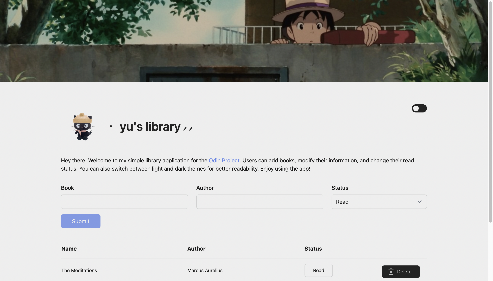

# Library App

[Live Demo](https://yusei07.github.io/library/)

In this project, I learned more on implementing objects in js, manipulating its properties/methods as well as the DOM elements.
The overall idea of the design I try to copy is notion, and I was able to achieve it thanks to Tailwind CSS.

### Features
- Delete book & toggle read status
- Responsive layout
- Input validation check
- Support dark/light mode
